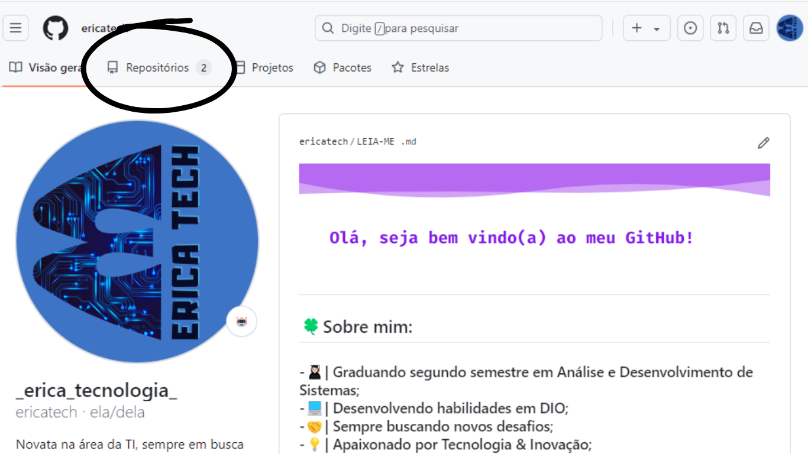
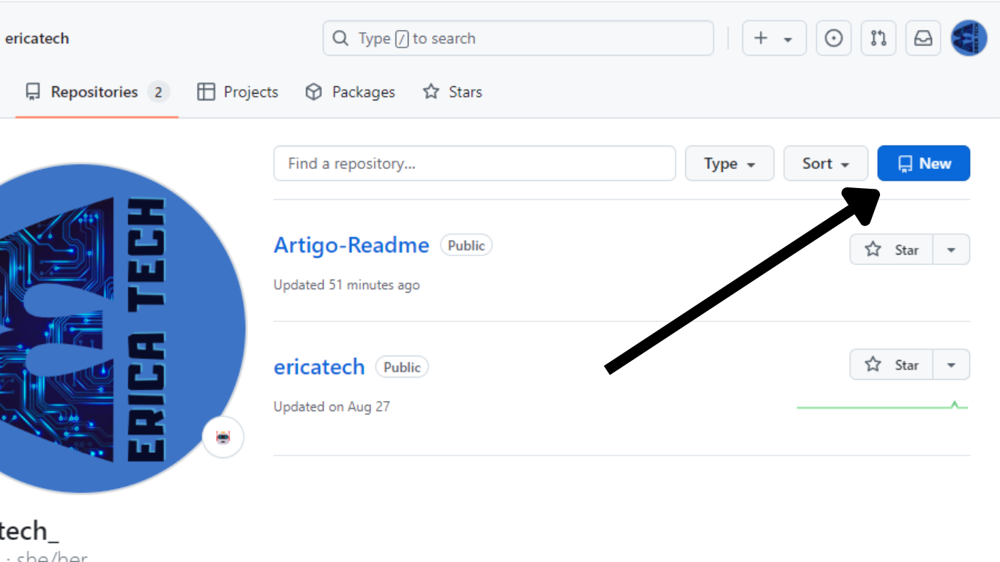
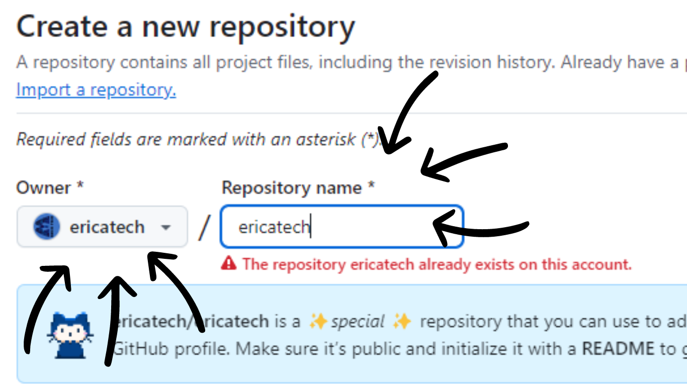
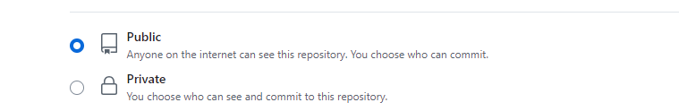
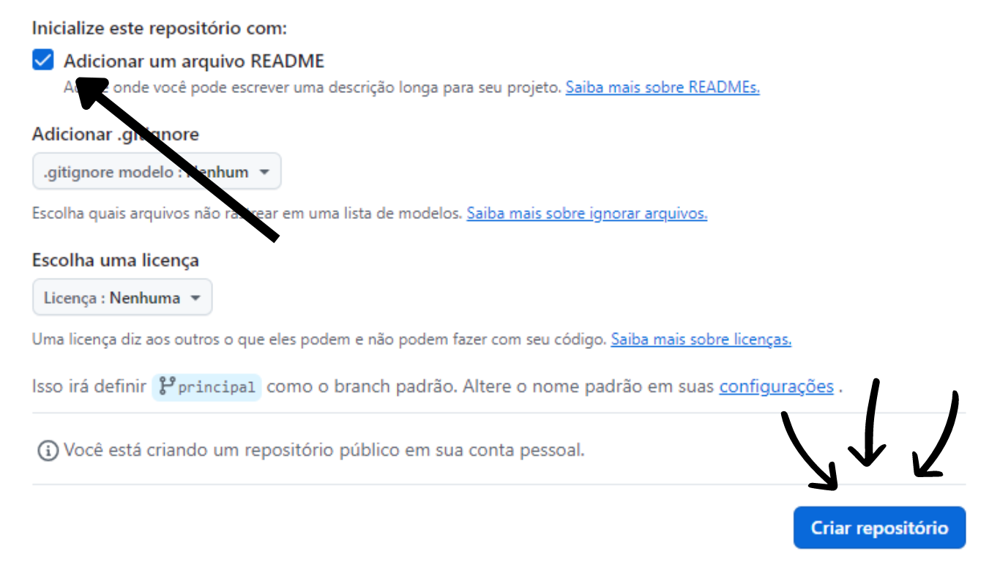
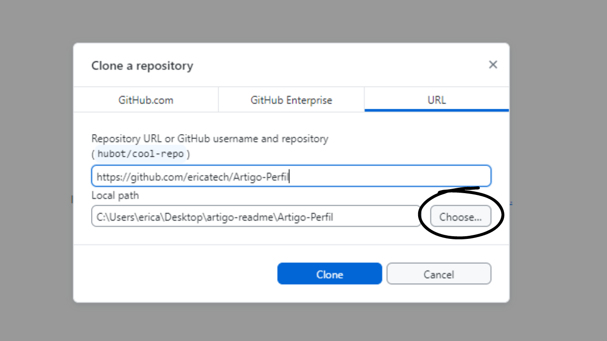
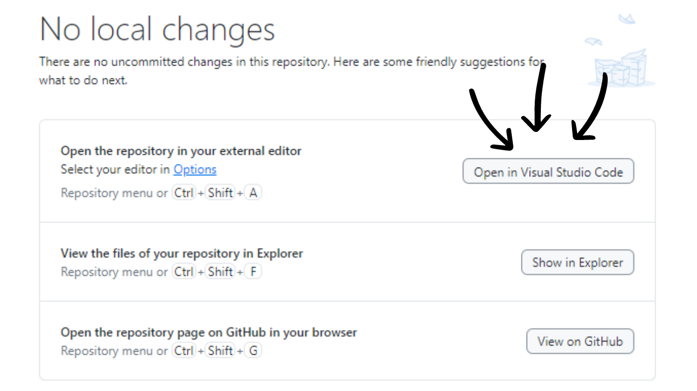
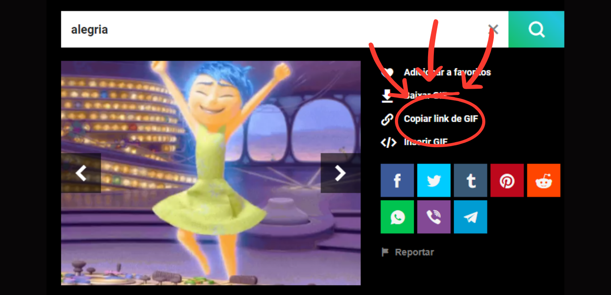
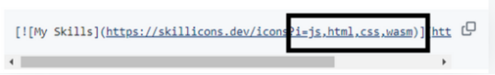
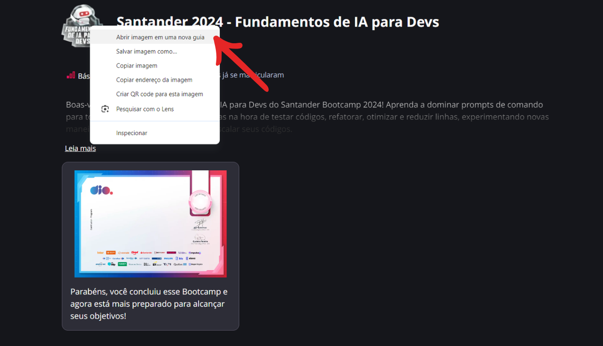

<h1 align="center">✨Como criar um README perfeito para colocar no seu perfil ✨.</h1>

#

<h1 align="center">1️⃣Primeiro passo: Criar um repositório para armazenar nosso código.1️⃣</h1>

## 🔵Na página principal no seu perfil do github, vá em "repositórios".

<div>
 
</div>

## 🔵A seguir clique em "NEW" ou "NOVO" no canto esquerdo.
<div>
 
</div>

## 🔵Precisa colocar o mesmo nome do seu perfil nesse repositório.

<div>
 
</div>

## 🔵Ele precisa ser público.

<div>
 
</div>

## 🔵Marque a opção "Adicionar um arquivo README" e clique no botão "Criar repositório".

<div>
 
</div>

#

# ✅Nosso repositório já está criado e pronto para receber nosso código!✅

#

<h1 align="center">2️⃣Segundo passo: Configurando nossa área de trabalho.2️⃣</h2>

<h1 align="center">❗Aqui é importante você já ter o Github Desktop e o Visual studio code instalado no seu computador, porque você será direcionado para o Github Desktop, abaixo estão os links para donwload, é bem fácil de baixar, e não tem erro❗</h1>


## VISUAL STUDIO CODE [https://code.visualstudio.com/download]
## GITHUB DESKTOP [https://desktop.github.com/download/]

<h2>O Visual Studio Code vai ser para criar nosso código e o Github Desktop para subir nosso projeto direto para nosso perfil.</h2>

## 🔵Ao criar o repositório, você é direcionado para essa página! então basta clicar em "Configurar no Desktop".
<div>
 
</div>

## 🔵Aqui você precisa buscar a pasta que deseja clonar seu repositório, basta clicar em "CHOOSE" e procurar a pasta no seu computador para clonar (se caso não tenha a pasta é só criar na área de trabalho do seu computador).
<div>
 
</div>
<div>
 
</div>

## 🔵Próximo passo é abrir o Visual Studio Code, no próprio Github Desktop vai te dar essa opção logo após você clonar a pasta.
<div>
 
</div>

## 🔵Agora precisamos criar o arquivo em markdown, para começar a codar. Basta clicar em "ARQUIVOS" depois "NOVO ARQUIVO" e nomear como MARKDOWN.MARKDOWN.

## ✅E pronto! nosso ambiente já está pronto.✅

<h1 align="center">3️⃣Terceiro passo: Construindo nosso código.3️⃣</h2>

## 🔵Para adicionar essa barrinha, é bem fácil! primeiro você entra nesse site [https://capsule-render.vercel.app/], e personaliza a sua.

## 🔵Depois basta copiar esse código que é gerado.
<div>
 
</div>

## 🔵Ao copiar esse código, deve ser colocado dentro de uma DIV, assim.

````Markdonw
<div>
 
</div>
````
## 🔵Então vai ficar assim;
<div>
 
</div>

## 🔵Agora vamos personalizar nossa frase, nesse site [https://readme-typing-svg.demolab.com/demo/].

## 🔵Aqui você personaliza sua frase, do lado esquerdo é para definir o texto, a cor, o tamanho da sua frase, e ao lado direito é o código que vamos utilizar, pode ser qualquer um dos dois código que foi gerado.
<div>
 
</div>

## 🔵Código copiado, agora nós vamos colocar lá no nosso README.

````Markdown
 <div> 
 
 [](https://git.io/typing-svg)
 
 </div>
````
## 🔵Então ficara assim:

<div>

 [](https://git.io/typing-svg)

</div>

<div align="center">
 <h1>Como adicionar um Gif ao nosso projeto?</h1>
 
</div>

## 🔵É muito simples, é copia e cola! você entra no site, escolhe o gif que deseja e copia o código, assim:

<div>
 
</div>

## 🔵E cola no projeto, Assim:

````Markdown
 <div> 
  
 </div>
````

## 🔵Caso o Gif fique muito grande você pode estilizar colocando um "width" e o tamanho em "px", assim:

````Markdown
 <div> 
  
 </div>
````

## 🔵Aqui estão alguns sites:
- [https://gifer.com/pt/]
- [https://tenor.com/pt/]
- [https://giphy.com/]
- [https://pixabay.com/pt/]

<div align="center">
 <h1>Agora como adicionar as Habilidades?.</h1>
</div>

<div align="center">
 
</div> 

## 🔵Vamos fazer a busca nesse site[https://skillicons.dev/]

## 🔵O link principal para colar no seu projeto é esse que esta abaixo, porém precisamos trocar algumas coisas nele.

````Markdown 
 [](https://skillicons.dev)
````
## 🔵Precisa substituir o "js,html,css,wasm" para as habilidades que deseja colocar no projeto:

<div>
 
</div>

## ❗Lembrando você só vai substituir depois do "i=".❗

## 🔵Exemplo: Eu quero colocar as habilidades debian, docker e git.

````Markdown 
 [](https://skillicons.dev)
````

## 🔵Então ele ficara assim:
<div>

 [](https://skillicons.dev)

</div>

<div align="center"> 
 <h1>Como colocar um distintivo?</h1>
</div>

## 🔵Primeiro você vai até a plataforma que você tem esse distintivo, normalmente você recebe depois de terminhar um curso.
<div>
 
</div>

## 🔵Clica com o botão direito do mouse encima da imagem, Depois clica em "Abrir em uma nova guia"
<div>
 
</div>

## 🔵Depois é só copiar o endereço de imagem:
<div>
 
</div>

## 🔵Então basta colar o endereço assim:

````Markdown
 <div>
 
 </div>
````
## 🔵E ta pronto, você pode mudar o tamanho usando o "width">

<div>
 
 </div>

## 

<div align="center">
 <h1>Como colocar o cartão de estatísticas no github?📊</h1>
</div>

<div align="center">


</div>

## 🔵Nesse site [https://github.com/anuraghazra/github-readme-stats/blob/master/themes/README.md] você pode encontrar o tema que deseja.


## 🔵Basta você copiar esse código e colar no seu projeto, trocando o username para seu nome.

````Markdown
 <div>

  [](https://github.com/anuraghazra/github-readme-stats)

  


 </div>
````

## Você também pode adicionar esse gráfico animado:

<div align="center">
 
</div>

## 🔵Vai até o site [https://ssr-contributions-svg.vercel.app/], personaliza o seu, então copie o código e cole dentro de uma DIV, assim:


````Markdown
 <div align="center">
 
</div>

````
#

<div align="center"> 
 <h1>✨Agora sim nosso README esta pronto! Obrigada por ler até aqui✨</h1> 
</div>
